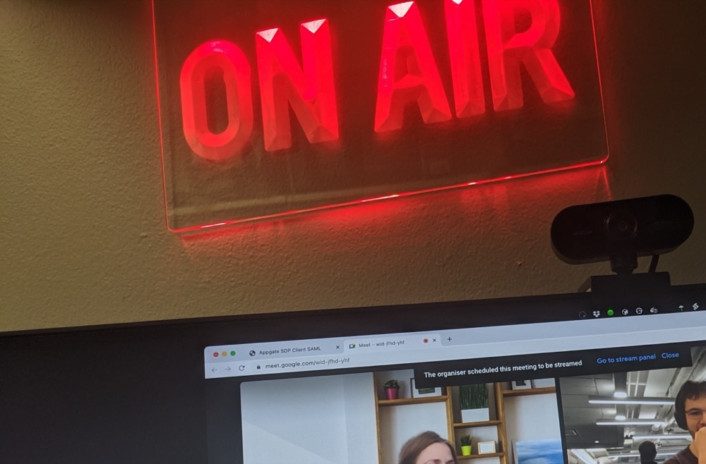

OnAir
==

A macOS menubar app that turns a light on and off through your
[Athom Homey Pro](https://homey.app/) whenever a camera is in use, so the people
around you know when you are in a call.

Camera usage is detected via CoreMediaIO (no camera permission needed), and the
light is driven directly over Homey's local HTTP API, so there is no cloud
roundtrip.



Install
--
Download the latest `OnAir.app` from the
[releases page](https://github.com/henrik242/OnAir/releases), or install with
[Homebrew](https://brew.sh/):

```
brew tap henrik242/brew
brew trust --cask henrik242/brew/onair
brew install --cask henrik242/brew/onair
```

`brew trust` is required because OnAir lives in a third-party tap; since Homebrew
6.0.0 such taps must be trusted before their casks can be installed.

Or build from source (below).

Setup
--
Everything is configured from **Settings…** in the menubar:

1. Create a Personal Access Token at <https://my.homey.app> (Settings -> API keys).
2. **Address**: press **Detect** to find your Homey Pro via mDNS (this happens
   automatically when no address is set), or type its IP or hostname.
3. **Token**: paste the token from step 1.
4. **Light**: pick the device to control. The list shows every Homey device that
   has an on/off switch, and reloads when the address or token changes.

The menubar icon shows a grey "On Air" when idle and blinks red while a camera is
on. You can also toggle the light manually from the menu.

Configuration file
--
Settings are stored in `~/.onair.ini` (created on first run). You can edit it
directly instead of using the menu:

```
[DEFAULT]
address=homey-xxxxxxxx.local
token=your-personal-access-token
device=abcd1234-5678-90ab-cdef-1234567890ab
debug=False
```

The light is switched with
`PUT http://<address>/api/manager/devices/device/<device>/capability/onoff`.

Build and run from source
--
`make` creates a local `.venv` and installs the dependencies there, so it never
touches your system Python.

```
make          # build OnAir.app into dist/
make debug    # run from source with debug logging
make run      # run from source
```

To list on/off devices from the command line: `.venv/bin/python OnAir.py --list-devices`.

Thanks to
--
- <https://github.com/jaredks/rumps>
- <https://github.com/python-zeroconf/python-zeroconf>
- <https://github.com/ronaldoussoren/py2app>
- <https://camillovisini.com/article/create-macos-menu-bar-app-pomodoro/>
